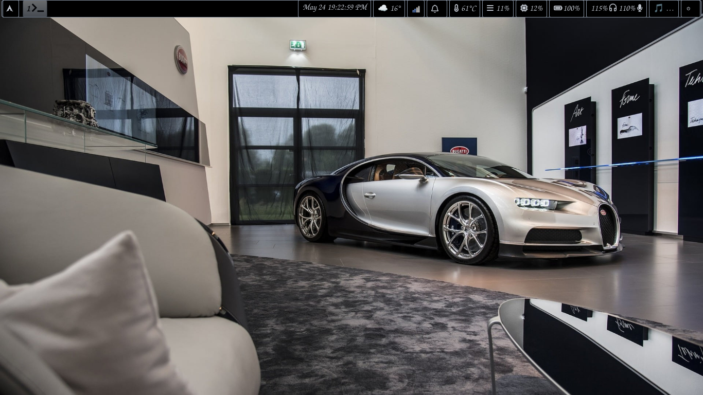
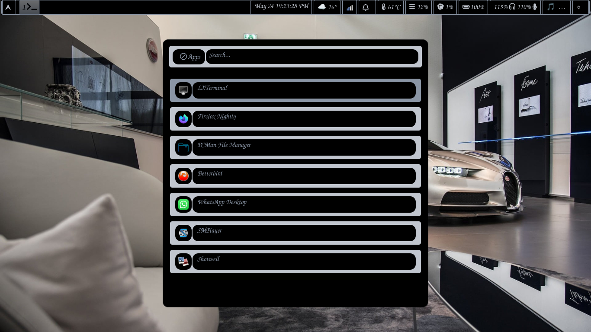
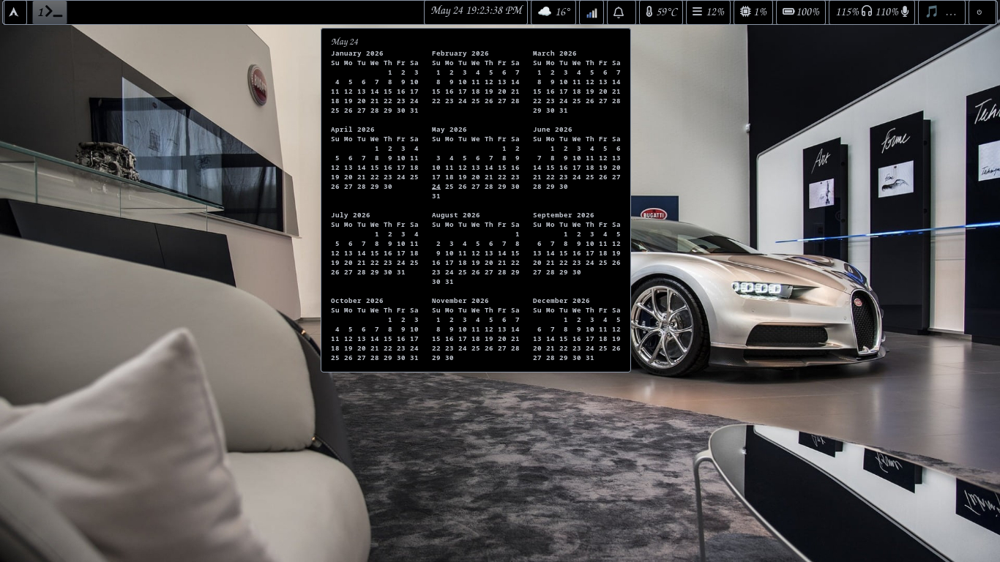
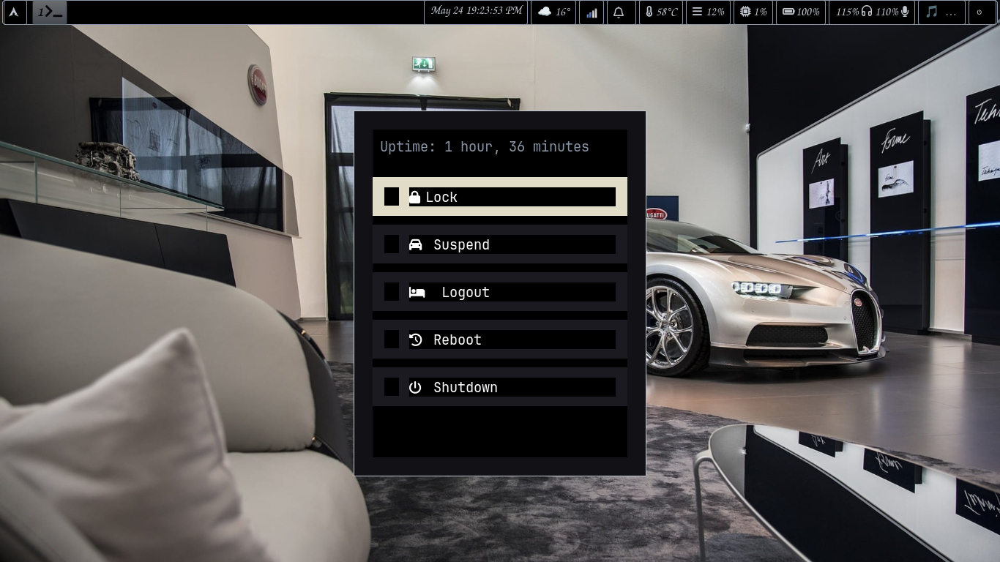

<div align="center">

  
  
  
  

  <br><br>

  Simple Stacking Wayland Compositor on Arch Linux.

</div>

---


# Scroll Config for Arch Linux

Personal Scroll compositor configuration with Waybar (bottom bar) and powermenu scripts.

## 📁 Structure
```text

~/.dotfiles/scroll/
├── configs/
│   ├── scroll/
│   │   ├── config          # Main Scroll config
│   │   └── config.d/       # Additional config snippets
│   └── waybar/
│       ├── config.jsonc    # Waybar layout & modules
│       ├── style.css       # Waybar theme
│       └── scripts/
│           ├── modern-dark.rasi  # Rofi theme for powermenu
│           ├── power.rasi        # Powermenu styling
│           └── powermenu.sh      # Shutdown/reboot script
├── .gitignore
└── README.md
```


## 📸 Screenshots







